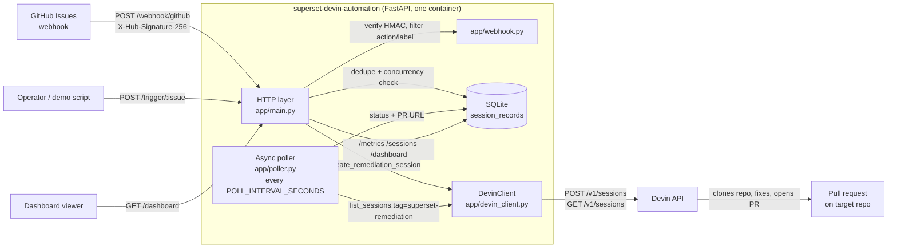

# superset-devin-automation

A small, Dockerized FastAPI service that turns GitHub issues into Devin
remediation sessions, tracks each session to completion, and reports system
health on a dashboard that a non-engineer can read.

## Problem statement

Apache Superset (like most large open-source projects) accumulates well-scoped
bug reports faster than maintainers can pick them up. Each one costs an
engineer the same fixed overhead — read the report, reproduce it, find the code,
fix, test, open a PR — even when the fix itself is small. This service removes
that overhead from the human loop: when an issue is opened or labelled
`devin-remediate`, it verifies the GitHub webhook, hands the issue to a Devin
session with a remediation prompt, enforces a concurrency cap so cost stays
bounded, polls Devin until the session finishes, records the resulting pull
request, and exposes throughput / success-rate metrics so a lead can answer
"is this working?" without reading code.

## Architecture



Data flow for one issue:

1. GitHub (or the manual trigger) delivers an issue. The signature is checked
   with `GITHUB_WEBHOOK_SECRET`; only `opened` events and `labeled` events
   carrying `devin-remediate` continue.
2. The issue is rejected as a duplicate if a record already exists, or with
   HTTP 429 if `MAX_CONCURRENT_SESSIONS` active/blocked sessions are running.
3. `DevinClient.create_remediation_session` posts a prompt to the Devin API,
   tagged `superset-remediation` and `issue-<n>`, and a `session_records` row
   is inserted with `status=active`.
4. The poller lists Devin sessions by tag, maps Devin's `status_enum` to
   `active | blocked | completed | failed`, extracts `pull_request.url`, and
   logs every status transition as a structured JSON event.
5. `/metrics` and `/dashboard` read the table; nothing else is stateful.

Design choices worth knowing for review:

* **Single process, plain `sqlite3`.** No ORM, no broker, no external DB. The
  poller is an `asyncio` task inside the web process; a Devin API outage is
  logged and retried on the next tick rather than crashing the service.
* **All triggers share one code path** (`start_remediation` in `app/main.py`):
  dedupe, concurrency limit, session creation, and persistence behave
  identically for webhooks and manual triggers.
* **Structured JSON logs** (`app/logging_config.py`) — one object per line with
  `event`, `issue_number`, `session_id`, `old_status`/`new_status` fields, so
  the pipeline is greppable and ships straight into any log aggregator.
* **Devin API v1** is used (`POST/GET /v1/sessions`). Field names
  (`session_id`, `url`, `status_enum`, `pull_request.url`, `tags`) were
  verified against the published OpenAPI spec and a live session. Devin marks
  v1 as legacy; migrating to the v3 organisation-scoped API is a contained
  change in `app/devin_client.py`.

## Repository layout

| Path | Purpose |
| --- | --- |
| `app/main.py` | FastAPI app, lifespan (DB init, poller task), all HTTP endpoints |
| `app/webhook.py` | HMAC verification and issue-event filtering |
| `app/devin_client.py` | Async Devin API client and remediation prompt |
| `app/poller.py` | Background poll loop, status mapping, PR-URL extraction |
| `app/db.py` | SQLite schema, record CRUD, metrics aggregation |
| `app/logging_config.py` | JSON log formatter and `log_event` helper |
| `app/templates/dashboard.html` | Framework-free dashboard (HTML + vanilla JS) |
| `scripts/simulate_events.py` | Posts `scripts/sample_issues.json` to `/trigger` |
| `scripts/mock_devin_api.py` | Stand-in Devin API for demos and CI-free testing |
| `scripts/send_webhook.py` | Signs and sends an example webhook payload |
| `examples/*.json` | Sample GitHub `issues` webhook payloads |
| `tests/` | pytest suite (webhook auth, trigger, limits, poller, metrics, logging) |

## Setup

### Prerequisites

* Docker with Compose v2 (or Python 3.11+ for a local run).
* A Devin API key (Devin → Settings → API keys).
* A GitHub repository you can add a webhook to.

### 1. Configure

```bash
cp .env.example .env          # Windows: Copy-Item .env.example .env
```

Set at minimum:

```dotenv
DEVIN_API_KEY=<your Devin API key>
GITHUB_WEBHOOK_SECRET=<random string; reuse it when registering the webhook>
SUPERSET_REPO=<org>/<repo>    # repo Devin should fix when the trigger omits one
```

All variables:

| Variable | Required | Default | Description |
| --- | --- | --- | --- |
| `DEVIN_API_KEY` | yes | - | Devin API bearer token |
| `GITHUB_WEBHOOK_SECRET` | yes | - | Secret used for HMAC webhook validation |
| `DEVIN_API_BASE_URL` | no | `https://api.devin.ai/v1` | Devin API base URL (point at the mock for demos) |
| `DATABASE_PATH` | no | `data/sessions.db` | SQLite database path |
| `POLL_INTERVAL_SECONDS` | no | `30` | Devin polling interval |
| `REMEDIATION_LABEL` | no | `devin-remediate` | Label that triggers remediation |
| `SESSION_TAG` | no | `superset-remediation` | Tag used to find Devin sessions |
| `MAX_CONCURRENT_SESSIONS` | no | `5` | Active + blocked session limit (HTTP 429 above it) |
| `SUPERSET_REPO` | no | empty | Repository fallback as `org/repo` |
| `TRIGGER_TOKEN` | no | empty | If set, `/trigger` requires a matching `X-Trigger-Token` header |
| `DISABLE_POLLER` | no | `false` | Disable polling (used by the test suite) |

### 2. Run

```bash
docker compose up --build -d
curl http://localhost:8000/health        # {"status":"ok"}
open http://localhost:8000/dashboard
```

SQLite data persists in `./data` (mounted at `/app/data`). Without Docker:

```bash
python -m venv .venv && source .venv/bin/activate   # Windows: .venv\Scripts\Activate.ps1
pip install -r requirements.txt -r requirements-dev.txt
uvicorn app.main:app --host 0.0.0.0 --port 8000
```

### 3. Register the GitHub webhook

In the target repository open **Settings → Webhooks → Add webhook**:

* Payload URL: `https://<public-host>/webhook/github`
* Content type: `application/json`
* Secret: the value of `GITHUB_WEBHOOK_SECRET`
* Events: **Let me select individual events → Issues**

For a laptop, expose port 8000 first (`ngrok http 8000`) and use the ngrok URL.
GitHub's "Recent Deliveries" tab shows the response; `202` means a session was
created, `200` with `"ignored"` means the event did not match (wrong action or
label), `401` means the secret does not match.

Behaviour: an `opened` issue always triggers remediation; an existing issue
triggers when `devin-remediate` is added. Everything else is ignored.

### 4. Run the simulation script (no GitHub, no Devin spend)

The demo profile adds a mock Devin API that walks each session through
`working → blocked → finished` in ~40 s and returns a fake PR URL.

```bash
# .env additions for demo mode
# DEVIN_API_BASE_URL=http://mock-devin:9000/v1
# POLL_INTERVAL_SECONDS=10

docker compose --profile demo up --build -d
python scripts/simulate_events.py --delay 2
```

The script reads `scripts/sample_issues.json` (five real Superset issues, see
below) and POSTs each to `/trigger/{issue_number}`. Expected result: five
`200` responses, five rows on the dashboard, a sixth trigger returns `429`, and
within a minute the health banner reads "Healthy — fixes are being delivered".

Options: `--url`, `--issues` (path to the JSON file), `--delay`, `--token`
(when `TRIGGER_TOKEN` is set).

### Simulate a raw GitHub webhook

```bash
python scripts/send_webhook.py examples/issue_opened.json --secret testsecret
```

or with `openssl` + `curl`:

```bash
secret='testsecret'; payload='examples/issue_opened.json'
signature=$(openssl dgst -sha256 -hmac "$secret" "$payload" | sed 's/^.* //')
curl -i -X POST http://localhost:8000/webhook/github \
  -H 'Content-Type: application/json' -H 'X-GitHub-Event: issues' \
  -H "X-Hub-Signature-256: sha256=$signature" --data-binary @"$payload"
```

## The 5 remediated Superset issues

`scripts/sample_issues.json` contains five real, open `apache/superset` bug
reports (titles and bodies taken verbatim from GitHub, bodies truncated to
~1500 characters). They were chosen because each is a concrete, reproducible
defect scoped to a single area of the codebase — the kind of issue an
autonomous agent can realistically close.

| # | Issue | Area | Remediation PR |
| --- | --- | --- | --- |
| [#43420](https://github.com/apache/superset/issues/43420) | Table "Show summary" row overrides every metric aggregate with SUM, breaking COUNT_DISTINCT | Table chart | see note |
| [#39951](https://github.com/apache/superset/issues/39951) | Superset 6.0.0 bug: Could not convert string '849' to numeric | Query/pandas coercion | see note |
| [#40704](https://github.com/apache/superset/issues/40704) | Filters not applied to charts after navigating away from and back to a multi-tab dashboard | Dashboard native filters | see note |
| [#38936](https://github.com/apache/superset/issues/38936) | Bug with filter time grain when trying to add default value | Native filters | see note |
| [#40419](https://github.com/apache/superset/issues/40419) | Mixed Timeseries Chart value labels use the wrong Y-axis formatter | ECharts plugin | see note |

**Note on PR links.** In the recorded demo runs these five issues were driven
through the full pipeline against the bundled mock Devin API, so the PR URLs
stored in `session_records` are mock placeholders, not real pull requests.
Real remediation sessions were verified separately with a live `DEVIN_API_KEY`
using smoke-test payloads (session creation, tag filtering and status polling
all confirmed against the real API). To produce real PRs, point
`DEVIN_API_BASE_URL` back at `https://api.devin.ai/v1`, set `SUPERSET_REPO` to
your Superset fork, and re-run `scripts/simulate_events.py`; the dashboard's
"Open PR" links will then resolve to the PRs Devin opens. Each such run costs
Devin ACUs (see cost governance below).

## Endpoints

| Method | Path | Purpose |
| --- | --- | --- |
| `POST` | `/webhook/github` | Validate and process GitHub Issues events |
| `POST` | `/trigger/{issue_number}` | Manually start remediation (`{"title","body","repo_full_name"?}`) |
| `GET` | `/health` | Liveness check |
| `GET` | `/metrics` | Counts, success rate, throughput, average time-to-PR |
| `GET` | `/sessions` | Session records for the dashboard |
| `GET` | `/dashboard` | Auto-refreshing HTML dashboard |

Example `/metrics`:

```json
{
  "active": 1, "completed": 4, "failed": 1, "total": 6,
  "avg_completion_seconds": 1842.5,
  "success_rate_percent": 80.0,
  "throughput_per_hour": 0.12,
  "completed_last_hour": 2,
  "avg_time_to_pr_seconds": 1750.0,
  "poll_interval_seconds": 30,
  "max_concurrent_sessions": 5
}
```

* `success_rate_percent` — completed ÷ (completed + failed); `null` until a
  session finishes.
* `throughput_per_hour` — completed ÷ hours since the earliest record (floored
  at one hour).
* `avg_time_to_pr_seconds` — mean created→completed for sessions that produced
  a PR.
* Status mapping from Devin: `finished → completed`, `expired → failed`,
  `blocked → blocked`, anything else → `active`.

The dashboard leads with a colour-coded health banner (green ≥ 80 % success,
amber ≥ 50 %, red below) and four cards — issues processed, success rate,
average time to PR, sessions in progress — followed by the full session table.
It refreshes every 10 seconds.

## Structured logs

One JSON object per line, e.g.

```json
{"ts":"2026-09-02T17:11:22+00:00","level":"INFO","logger":"app.main","event":"session_created","message":"session_created","source":"manual","issue_number":43420,"session_id":"devin-…","repo":"PRad712/superset"}
{"ts":"2026-09-02T17:12:05+00:00","level":"INFO","logger":"app.poller","event":"session_status_transition","message":"session_status_transition","issue_number":43420,"session_id":"devin-…","old_status":"active","new_status":"completed","pr_url":"https://github.com/…/pull/1"}
```

Event names: `webhook_received`, `webhook_ignored`, `webhook_rejected`,
`session_created`, `session_duplicate`, `rate_limited` (concurrency limit),
`session_status_transition`, `poll_failed`.

## Tests and lint

```bash
ruff check .
pytest -q
```

CI (`.github/workflows/ci.yml`) runs both on every push and PR. Tests use
temporary SQLite databases, a stubbed Devin client, and `DISABLE_POLLER=1`.
Without a local Python toolchain:

```bash
docker run --rm -v "$PWD:/app" -w /app python:3.11-slim \
  sh -c "pip install -q -r requirements.txt -r requirements-dev.txt && ruff check . && pytest -q"
```

## Extending this for production

The current service is intentionally a single-repo, single-tenant proof of
concept. The following are the changes we would make first.

### Multi-repo support

* Replace the `SUPERSET_REPO` fallback with a **repository registry**
  (`repos` table or YAML: `full_name`, `default_branch`, `label`,
  `session_tag`, `max_concurrent`, `enabled`). The webhook handler already
  receives `repository.full_name`; look it up and reject unknown repos.
* Tag sessions with `repo:<owner>/<name>` in addition to the issue tag so the
  poller can list per repo and the dashboard can filter/group by repository.
* Add `repo_full_name` to `session_records` (today only the issue number is
  stored, so two repos sharing an issue number would collide in the dedupe
  check).
* Register one **GitHub App** instead of per-repo webhooks: a single
  installation covers every repository in the org, delivers the same `issues`
  events, and gives Devin an installation token scoped to the repos it may push
  to.
* Per-repo prompt templates (`build_remediation_prompt` is already a pure
  function) for stacks with different test/lint commands.

### Slack and Jira triggers

The HTTP layer already funnels every trigger through `start_remediation`, so
new sources are thin adapters:

* **Slack** — a slash command (`/devin-fix owner/repo#1234`) or an
  `app_mention` handler, verified with Slack's signing secret exactly as the
  GitHub HMAC is today, that fetches the issue title/body from the GitHub API
  and calls `start_remediation(source="slack")`. Post status transitions back
  to the originating thread from the poller (`session_status_transition`
  events already carry everything needed).
* **Jira** — a Jira Automation webhook on "issue transitioned to *Ready for
  Devin*" hitting `/webhook/jira`; map `issue.key` → a GitHub issue (via a
  custom field or by having Devin open the GitHub issue itself) and store the
  Jira key in `result` so the poller can transition the Jira ticket when the
  PR appears.
* Add a `source` column to `session_records` (currently only logged) so
  metrics can be split by trigger origin.

### Cost governance via `max_acu_limit`

Devin sessions are billed in ACUs. Today the only guard is
`MAX_CONCURRENT_SESSIONS`, which caps parallelism but not spend per session.

* Pass `max_acu_limit` on `POST /v1/sessions` (`create_remediation_session`
  already builds the payload; add the field from a new `MAX_ACU_PER_SESSION`
  setting, e.g. `10`). Devin stops the session when the cap is reached, so a
  runaway remediation cannot exceed a known cost.
* Track ACU consumption: the session object returned by `GET /v1/sessions`
  can be extended with usage data; persist it per record and expose
  `total_acus`, `avg_acus_per_pr`, and `cost_per_successful_pr` on `/metrics`
  and as a dashboard card.
* Add a **daily/weekly ACU budget** (`ACU_BUDGET_PER_DAY`): `start_remediation`
  returns `429` with a `budget_exhausted` reason once the rolling sum of
  completed-session ACUs plus in-flight caps exceeds it.
* Per-repo limits in the registry above, and an alert (`budget_warning`
  structured event → Slack) at 80 % of budget.
* Use Devin's `idempotent: true` flag (already sent) so webhook redeliveries
  never create duplicate billable sessions.

### Other hardening

* Persist to Postgres (the SQL is standard; `app/db.py` is the only touch
  point) and run the poller as a separate process for horizontal scaling.
* Authenticate `/dashboard`, `/metrics`, and `/sessions` (SSO proxy or bearer
  token) — they are unauthenticated today.
* Migrate `DevinClient` to the v3 organisation-scoped API before v1 is retired.
* Wire `poll_failed` and `rate_limited` events to alerting.

## License

MIT — see [LICENSE](LICENSE).
